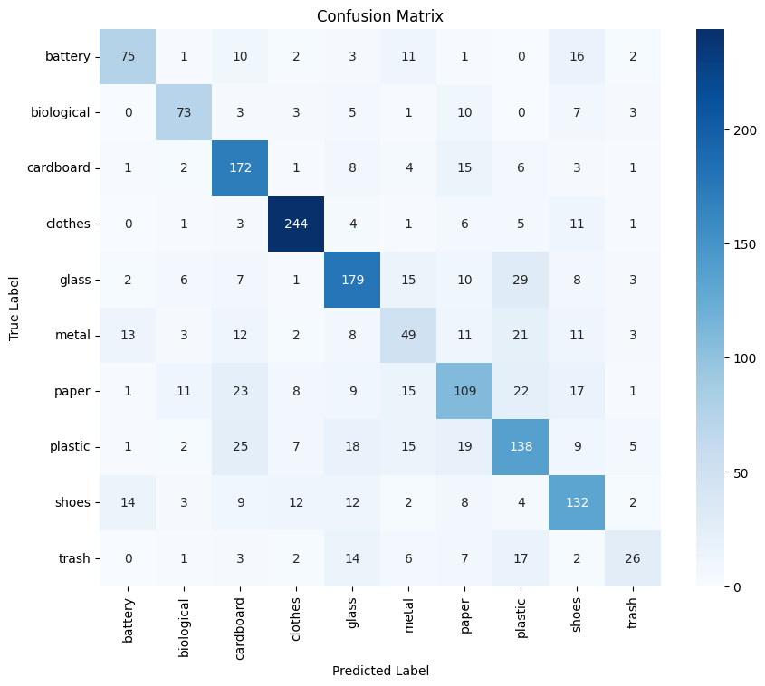
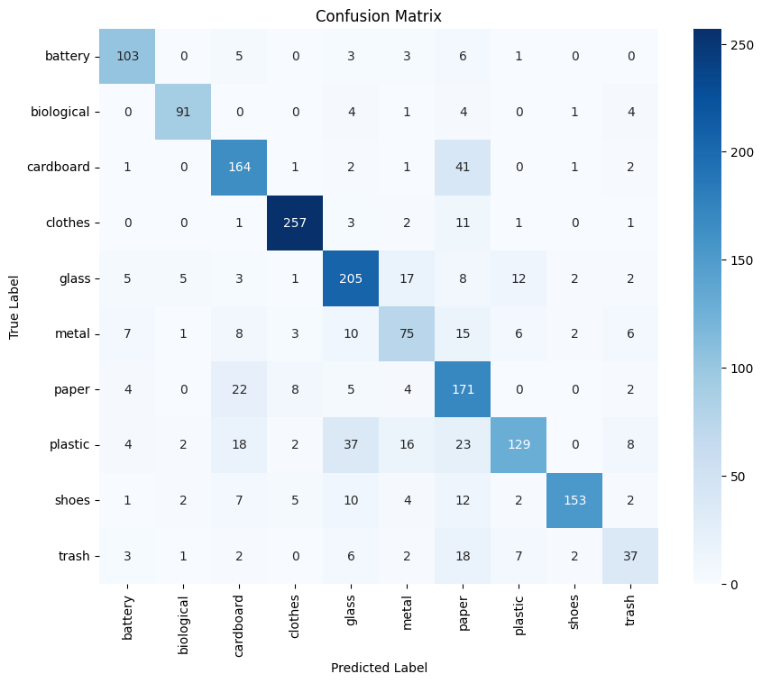

# 🗑️ Waste Classification using Deep Learning

A Deep Learning project that classifies waste images into multiple categories using two different approaches:

- 🧠 Custom Convolutional Neural Network (CNN)
- 🚀 Transfer Learning with ResNet18

The objective of this project is to compare a CNN built from scratch with a pretrained ResNet18 model and analyze their performance on a waste classification dataset.

---

## 📌 Project Overview

Waste classification plays an important role in automated recycling systems and smart waste management.

In this project:

- Built a Custom CNN model from scratch.
- Applied Transfer Learning using a pretrained ResNet18 model.
- Performed image preprocessing and data augmentation.
- Used Early Stopping to reduce overfitting.
- Evaluated both models using Accuracy, Confusion Matrix, and Classification Report.
- Compared the performance of both approaches.

---

## 📂 Project Structure

```
Waste-Classification-Using-Deep-Learning/
│
├── 01_Custom_CNN.ipynb
├── 02_Transfer_Learning_ResNet18.ipynb
├── README.md
└── images/
```

---

## 📊 Dataset

- Waste Image Dataset
- Multi-class image classification
- Images resized before training
- Separate Training, Validation, and Test datasets

---

## 🛠️ Technologies Used

- Python
- PyTorch
- Torchvision
- NumPy
- Matplotlib
- Scikit-learn
- Google Colab

---

## 🧠 Model 1 — Custom CNN

### Architecture

- Convolution Layers
- Batch Normalization
- ReLU Activation
- Max Pooling
- Dropout
- Fully Connected Layers

### Techniques Used

- Data Augmentation
- Batch Normalization
- Dropout
- Early Stopping

### Test Accuracy

**65.09%**

---

## 🚀 Model 2 — Transfer Learning (ResNet18)

### Approach

- Pretrained ResNet18
- Frozen Feature Extraction Layers
- Replaced Final Fully Connected Layer
- Fine-tuned Classifier

### Techniques Used

- Transfer Learning
- Data Augmentation
- Early Stopping

### Test Accuracy

**75.31%**

---

## 📈 Performance Comparison

| Model | Test Accuracy |
|--------|--------------:|
| Custom CNN | **65.09%** |
| ResNet18 Transfer Learning | **75.31%** |

### Observation

Transfer Learning outperformed the Custom CNN by leveraging features learned from the ImageNet dataset, resulting in improved classification accuracy and better generalization.

---

## 📊 Results

### Custom CNN Confusion Matrix



---

### ResNet18 Transfer Learning Confusion Matrix



---

## 📷 Evaluation

Both models were evaluated using:

- Test Accuracy
- Confusion Matrix
- Classification Report
- Precision
- Recall
- F1-Score

---

## 🚀 Future Improvements

- Train for more epochs with learning rate scheduling.
- Experiment with EfficientNet and DenseNet.
- Perform hyperparameter tuning.
- Handle class imbalance using weighted loss or oversampling.
- Deploy the model as a web application using Flask or Streamlit.

---

## 🎯 Key Learning Outcomes

- Building CNN architectures from scratch.
- Understanding Transfer Learning.
- Working with image datasets using PyTorch.
- Applying data augmentation techniques.
- Preventing overfitting using Early Stopping.
- Evaluating Deep Learning models using multiple performance metrics.

---

## 👩‍💻 Author

**Sai Harshita Gadde**

B.Tech CSE (Artificial Intelligence & Machine Learning)

GITAM University, Visakhapatnam

GitHub: https://github.com/Saiharshitha-999

LinkedIn: https://www.linkedin.com/in/sai-harshita-gadde
